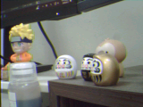

# NUCLEO-F446RE OV7670 JPEG Camera

[English README](README.md)

這個專案使用 NUCLEO-F446RE 開發板連接 OV7670 攝影機模組，透過 STM32F446RE 擷取 RGB565 影像，接著在 MCU 端進行 JPEG 壓縮，最後經由 UART 傳送到 PC。PC 端 Python 腳本會接收 binary frame、驗證 checksum、儲存 JPEG payload，並解壓縮成一般圖片檔。



## 主要功能

- 以 STM32CubeIDE 建立，目標板為 NUCLEO-F446RE / STM32F446RETx。
- OV7670 影像資料透過 DCMI + DMA 擷取。
- OV7670 SCCB 控制以 GPIO bit-bang 實作。
- 相機 XCLK 由 PA8 / MCO1 輸出。
- 輸入影像格式為 RGB565，解析度為 160 x 120。
- JPEG encoder 針對 MCU SRAM 限制設計，避免大量暫存。
- JPEG 處理採 8 x 8 block 流程：RGB565 只針對目前 block 轉成 YCbCr，接著立刻做 DCT 與 quantization。
- Huffman table 會依照當前影像統計結果動態產生，不使用 JPEG 預設 Huffman table。
- UART frame protocol 包含 magic bytes、影像 metadata、payload 長度與 checksum。
- PC 端腳本支援 JPEG payload，同時保留原本 RGB565 / YUV422 的解碼路徑。

## 專案結構

```text
Core/
  Inc/
    main.h
    jpeg_encoder.h
  Src/
    main.c
    jpeg_encoder.c
script/
  receive_ov7670.py
assets/
  result.png
test_cam.ioc
STM32F446RETX_FLASH.ld
```

重要檔案：

- `Core/Src/main.c`：板子初始化、OV7670 register 設定、DCMI snapshot 擷取與 UART 傳輸。
- `Core/Src/jpeg_encoder.c`：低記憶體 RGB565-to-JPEG encoder。
- `script/receive_ov7670.py`：PC 端接收與解碼腳本。
- `test_cam.ioc`：STM32CubeMX / STM32CubeIDE 設定檔。

## 硬體需求

### 使用零件

- NUCLEO-F446RE 開發板。
- OV7670 攝影機模組，需支援 8-bit parallel output。
- 杜邦線。
- USB 線，用於 ST-LINK 供電、燒錄、除錯與 UART virtual COM port。

請使用 3.3 V 邏輯準位。不要將 OV7670 訊號腳接到 5 V。

### 接線表

| OV7670 訊號 | NUCLEO-F446RE / STM32F446RE 腳位 | 用途 |
|---|---|---|
| D0 | PC6 | DCMI data bit 0 |
| D1 | PC7 | DCMI data bit 1 |
| D2 | PC8 | DCMI data bit 2 |
| D3 | PC9 | DCMI data bit 3 |
| D4 | PC11 | DCMI data bit 4 |
| D5 | PB6 | DCMI data bit 5 |
| D6 | PB8 | DCMI data bit 6 |
| D7 | PB9 | DCMI data bit 7 |
| PCLK | PA6 | DCMI pixel clock |
| HREF / HSYNC | PA4 | DCMI horizontal sync |
| VSYNC | PB7 | DCMI vertical sync |
| XCLK | PA8 | MCO1 camera clock output |
| SIOC | PB13 | SCCB clock |
| SIOD | PB14 | SCCB data |
| 3V3 | 3V3 | 相機供電 |
| GND | GND | Ground |

UART 使用 USART2，透過 ST-LINK virtual COM port 與 PC 溝通：

| USART2 訊號 | 腳位 |
|---|---|
| TX | PA2 |
| RX | PA3 |

## 韌體建置與燒錄

### 軟體需求

- STM32CubeIDE，已在 STM32CubeIDE 1.18.1 測試。
- STM32Cube FW_F4 firmware package，已在 V1.28.3 測試。
- 本專案 `.ioc` 使用 STM32CubeMX database 6.14.1 產生。

### 使用 STM32CubeIDE 建置

1. 開啟 STM32CubeIDE。
2. 選擇 `File > Import...`。
3. 選擇 `General > Existing Projects into Workspace`。
4. 將此 repository 資料夾設為 root directory。
5. 匯入 `test_cam2` 專案。
6. 在專案上按右鍵，選擇 `Refresh`。
7. 使用 `Project > Build Project` 建置。

### 燒錄

1. 透過 USB 連接 NUCLEO-F446RE。
2. 完成專案建置。
3. 在 STM32CubeIDE 使用 `Run > Debug` 或 `Run > Run`。
4. 由 STM32CubeIDE 透過 ST-LINK 將程式燒錄到板子。

板子 reset 後，韌體流程如下：

1. 由 PA8 輸出 XCLK。
2. 初始化 PB13/PB14 上的 SCCB。
3. 讀取 OV7670 PID/VER registers。
4. 寫入 RGB565 QQVGA 相機 register table。
5. 擷取數張 warm-up frame。
6. 擷取最後一張 frame。
7. 將 RGB565 frame 壓縮成 JPEG。
8. 透過 USART2，以 921600 baud 傳送 JPEG frame 到 PC。

## PC 端接收腳本

### Python 套件需求

使用 Python 3，並安裝：

```bash
python -m pip install pyserial pillow numpy
```

### 執行方式

執行腳本前，請關閉所有 serial monitor。將 `COM5` 改成你電腦上的 ST-LINK virtual COM port。

```bash
python script/receive_ov7670.py --port COM5 --baud 921600 --output assets/result.png
```

Linux/macOS 的 port 可能會像 `/dev/ttyACM0`：

```bash
python script/receive_ov7670.py --port /dev/ttyACM0 --baud 921600 --output assets/result.png
```

收到 JPEG frame 時，腳本會輸出：

- `assets/result.jpg`：從板子收到的原始 JPEG payload。
- `assets/result.png`：解碼後的 RGB 圖片。

腳本也會依照 MCU header 內的 checksum 驗證 payload 是否完整。

## UART Frame Protocol

韌體會先送出 binary header，再送出 payload：

```c
typedef struct __attribute__((packed))
{
    uint8_t  magic[4];        // A5 5A 12 34
    uint16_t width;           // 160
    uint16_t height;          // 120
    uint16_t format;          // 3 = JPEG
    uint16_t bytes_per_pixel; // JPEG 時為 0
    uint32_t payload_len;     // JPEG byte count
    uint32_t checksum;        // JPEG payload 的 byte sum
} CameraFrameHeader_t;
```

目前定義的 format ID：

| Format | 意義 |
|---:|---|
| 1 | Raw RGB565 |
| 2 | Raw YUV422 |
| 3 | JPEG |

目前韌體送出的格式為 `3`。

## JPEG Encoder 設計

encoder 的設計目標是降低 STM32F446RE SRAM 使用量：

- 不配置完整 YCbCr frame buffer。
- 不配置完整 JPEG payload buffer。
- 不使用動態記憶體配置。
- RGB565 frame buffer 仍是來源影像。
- 每次只轉換、處理、消耗一個 8 x 8 block，再處理下一個 block。

JPEG 產生流程：

```text
RGB565 frame buffer
  -> 載入一個 8 x 8 block
  -> 只將該 block 轉為其中一個 Y/Cb/Cr component
  -> DCT
  -> quantization
  -> 統計 Huffman symbol 或輸出 entropy bits
  -> 下一個 component / 下一個 block
```

因為 Huffman table 是依照實際影像動態產生，所以 encoder 會對同一張 RGB565 frame 做多次 block scan：

1. 第一次：逐 block 統計 DC/AC symbol frequency。
2. 建立動態 JPEG Huffman tables。
3. 第二次：dry-run JPEG output，用來計算 payload 長度與 checksum。
4. 第三次：產生相同 JPEG stream，並實際經由 UART 傳送。

這樣會增加 MCU 運算時間，但可以避免在 SRAM 裡暫存整張 JPEG。
